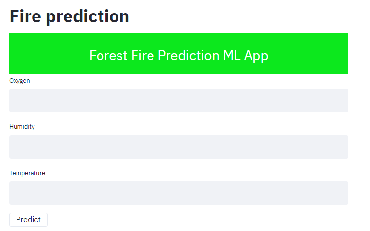
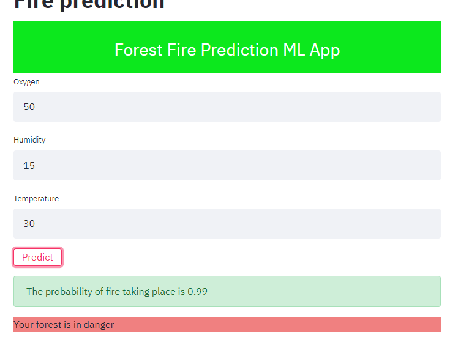
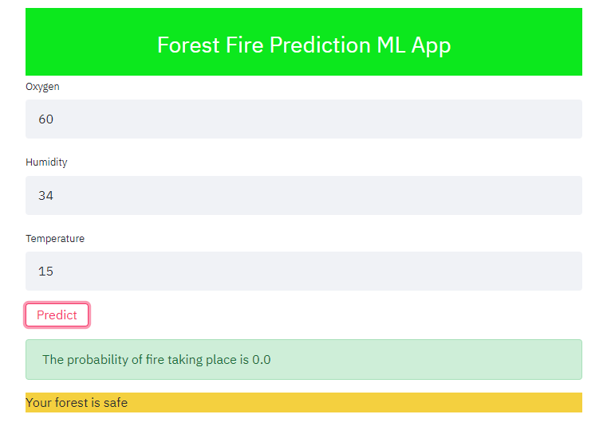

# Web APP to predict Forest Fire  
Forest Fire is a data science web application. We build this appication and we deploy it in a webpage using streamlit, following four main steps:  

1. Create and train a machine learning model
2. Dump into a pickle file
3. Build front end for web application using streamlit .
4. Make web app responsive by giving predictions in real time

# To launch the app
>  streamlit run app.py

